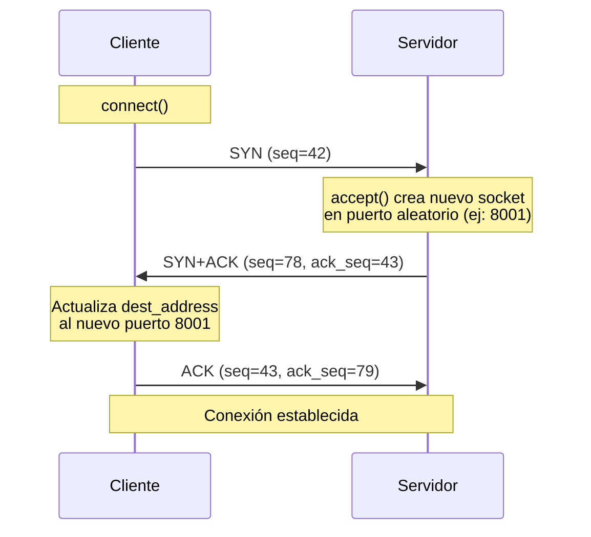
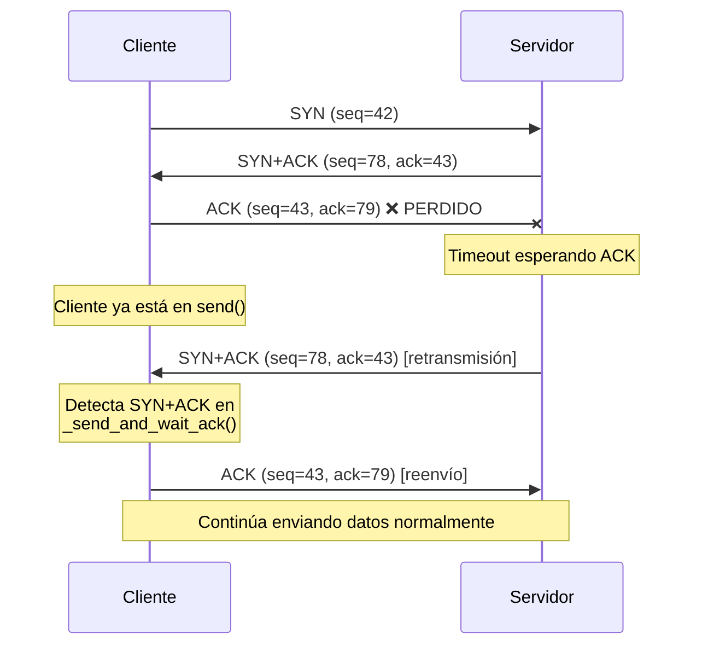
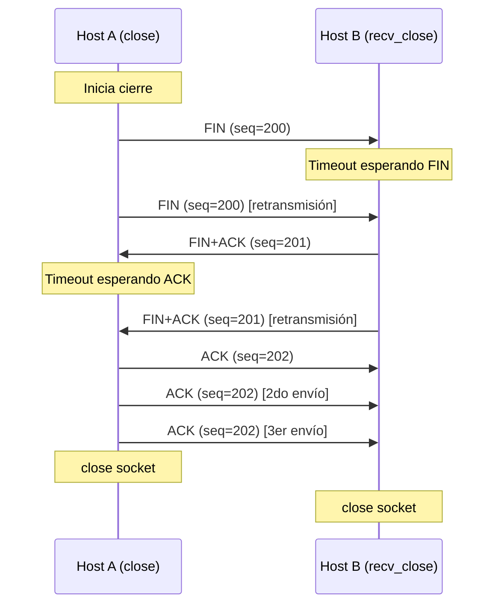

# Informe: Implementación de SocketTCP sobre UDP con Stop & Wait

## Introducción

Este informe documenta la implementación de una capa TCP simplificada sobre sockets UDP, utilizando el protocolo Stop & Wait para garantizar la entrega confiable de datos. La implementación incluye:

- Handshake de 3 vías (3-way handshake)
- Envío y recepción confiable de datos con manejo de pérdidas
- Cierre de conexión de 4 vías (4-way close)
- Manejo de timeouts y retransmisiones

## Estructura del Proyecto

```
TCP-UDP/
├── SocketTCP.py      # Clase principal que implementa TCP sobre UDP
├── cliente.py        # Cliente que envía archivos
├── servidor.py       # Servidor que recibe archivos
├── test_basico.py    # Tests unitarios
└── INFORME.md        # Este documento
```

## 1. Formato de Segmentos TCP

### 1.1 Estructura del Header

Los segmentos TCP se representan como strings con el siguiente formato:

```
SYN|||ACK|||FIN|||SEQ|||DATOS
```

**Campos:**
- `SYN`: Flag de sincronización (0 o 1)
- `ACK`: Flag de acknowledgment (0 o 1)
- `FIN`: Flag de finalización (0 o 1)
- `SEQ`: Número de secuencia (entero)
- `DATOS`: Payload del segmento (máximo 16 bytes)

**Ejemplos:**

```python
# SYN (inicio de handshake)
"1|||0|||0|||42|||"

# SYN+ACK (respuesta del servidor)
"1|||1|||0|||78|||"

# ACK (acknowledgment)
"0|||1|||0|||43|||"

# Datos
"0|||0|||0|||98|||Mensaje de prueba"

# FIN (cierre de conexión)
"0|||0|||1|||150|||"

# FIN+ACK (respuesta al cierre)
"0|||1|||1|||151|||"
```

### 1.2 Razones del Diseño

**¿Por qué usar strings con `|||` como separador?**

1. **Simplicidad**: Más fácil de debugear que trabajar con bytes crudos
2. **Flexibilidad**: El último campo (DATOS) puede contener cualquier contenido, incluyendo `|||`, gracias al uso de `split("|||", maxsplit=4)`
3. **Legibilidad**: Los segmentos son human-readable durante el testing

**¿Por qué SEQ a nivel de bytes (no por segmento)?**

Usamos números de secuencia a nivel de bytes (como TCP real) en lugar de números de segmento porque:

1. **Concordancia con el enunciado**: El ejemplo muestra `SEQ=98` para datos y `SEQ=115` para el ACK, donde `115 = 98 + 17` (largo de "Mensaje de prueba")
2. **Detección de duplicados**: Facilita detectar ACKs duplicados o retransmisiones
3. **Manejo de chunks**: Permite rastrear exactamente qué bytes fueron recibidos

**Cálculo del número de secuencia del ACK:**

```python
# Para datos
ack_seq = received_seq + len(data_received)

# Para SYN/FIN (sin datos, pero consumen 1 número de secuencia)
ack_seq = received_seq + 1
```

## 2. Handshake de 3 Vías

### 2.1 Diagrama del 3-Way Handshake



### 2.2 Asociación con Funciones

**Cliente (`connect()`):**
1. Elegir `seq` inicial aleatorio (0-100)
2. Enviar SYN con `seq`
3. Esperar SYN+ACK (con timeout y reintentos)
4. **Actualizar `dest_address`** con la dirección del nuevo socket del servidor
5. Enviar ACK final
6. Incrementar `seq` en 1 (SYN consume 1 número de secuencia)

**Servidor (`accept()`):**
1. Esperar SYN en el socket principal
2. **Crear nuevo SocketTCP** para la conexión
3. **Bind a puerto 0** (el OS asigna un puerto libre automáticamente)
4. Elegir `seq` inicial aleatorio (0-100)
5. Enviar SYN+ACK desde el **nuevo socket** (el cliente descubre el nuevo puerto aquí)
6. Esperar ACK (con timeout y reintentos)
7. Incrementar `seq` en 1
8. Retornar `(nuevo_socket, dirección_cliente)`

### 2.3 Caso Borde: Pérdida del ACK Final

**Diagrama:**



**Solución implementada:**

En el método `_send_and_wait_ack()`, si durante el envío de datos se recibe un segmento con flags `SYN=1` y `ACK=1`, el cliente re-envía el ACK del handshake:

```python
def _send_and_wait_ack(self, segment, expected_ack_seq):
    for attempt in range(MAX_RETRIES):
        self.udp_socket.sendto(segment.encode(), self.dest_address)
        try:
            response, addr = self.udp_socket.recvfrom(BUFFER_SIZE)
            parsed = self.parse_segment(response)

            # Caso borde: SYN+ACK retrasado
            if parsed["syn"] == 1 and parsed["ack"] == 1:
                ack_segment = self.create_segment(syn=0, ack=1, fin=0, 
                                                   seq=self.peer_seq + 1)
                self.udp_socket.sendto(ack_segment.encode(), self.dest_address)
                continue  # Reintentar recibir el ACK de datos

            if parsed["ack"] == 1 and parsed["seq"] == expected_ack_seq:
                return parsed
        except socket.timeout:
            pass
```

## 3. Envío y Recepción de Datos con Stop & Wait

### 3.1 Funcionamiento de `send(message)`

**Algoritmo:**

1. **Enviar prefijo de longitud:** El primer segmento contiene `str(len(message))` en el campo DATOS para informar al receptor cuántos bytes esperar
2. **Dividir en chunks:** El mensaje se divide en chunks de 16 bytes
3. **Stop & Wait:** Por cada chunk:
   - Enviar segmento con datos
   - Esperar ACK (con timeout)
   - Si timeout, retransmitir (hasta MAX_RETRIES=10)
   - Incrementar seq por `len(chunk_enviado)`

**Ejemplo:**

```python
Mensaje: "Hola mundo test 123!" (20 bytes)

# Segmento 1: prefijo de longitud
"0|||0|||0|||50|||20"
# (seq=50, datos="20")
# ACK esperado: seq=52 (50 + len("20"))

# Segmento 2: primer chunk
"0|||0|||0|||52|||Hola mundo test "
# (16 bytes)
# ACK esperado: seq=68 (52 + 16)

# Segmento 3: segundo chunk
"0|||0|||0|||68|||123!"
# (4 bytes)
# ACK esperado: seq=72 (68 + 4)
```

### 3.2 Funcionamiento de `recv(buff_size)`

El receptor debe manejar el caso en que `buff_size < message_length`, permitiendo múltiples llamadas a `recv()` para obtener el mensaje completo.

**Algoritmo:**

1. **Primera llamada** (`remaining_length == 0`):
   - Recibir segmento de prefijo de longitud
   - Setear `remaining_length = message_length`
   - Enviar ACK

2. **Usar buffer interno primero:**
   - Si `remaining_buffer` tiene datos, usarlos primero

3. **Recibir chunks de la red:**
   - Calcular `bytes_to_receive = min(remaining_length, buff_size)`
   - Recibir chunks hasta tener suficientes datos
   - Enviar ACK por cada chunk
   - Actualizar `remaining_length` después de cada chunk

4. **Manejo de overflow:**
   - Si `len(datos_recibidos) > buff_size`, guardar exceso en `remaining_buffer`
   - Retornar solo `buff_size` bytes

**Ejemplo con buff_size < message_length:**

```python
Mensaje: "Mensaje de largo 19" (19 bytes)
buff_size = 14

# Llamada 1: recv(14)
# - Recibe chunk 1: "Mensaje de largo" (16 bytes)
# - Retorna: "Mensaje de lar" (14 bytes)
# - remaining_buffer: b"go"
# - remaining_length: 3

# Llamada 2: recv(14)
# - Usa buffer: b"go" (2 bytes)
# - Recibe chunk 2: " 19" (3 bytes)
# - Retorna: b"go 19" (5 bytes)
# - remaining_buffer: b""
# - remaining_length: 0
```

### 3.3 Manejo de Pérdidas con Stop & Wait

El protocolo Stop & Wait garantiza entrega confiable:

1. **Timeout fijo:** 1 segundo (configurable en `TIMEOUT`)
2. **Máximo de reintentos:** 10 intentos (configurable en `MAX_RETRIES`)
3. **Patrón de reintento:**

```python
def _send_and_wait_ack(self, segment, expected_ack_seq):
    self.udp_socket.settimeout(self.timeout)
    
    for attempt in range(MAX_RETRIES):
        # Enviar segmento
        self.udp_socket.sendto(segment.encode(), self.dest_address)
        
        try:
            # Esperar ACK
            response, addr = self.udp_socket.recvfrom(BUFFER_SIZE)
            parsed = self.parse_segment(response)
            
            # Verificar que es el ACK correcto
            if parsed["ack"] == 1 and parsed["seq"] == expected_ack_seq:
                return parsed
        except socket.timeout:
            pass  # Reintentar
    
    raise ConnectionError("Se agotaron los reintentos esperando ACK")
```

## 4. Cierre de Conexión

### 4.1 Diagrama del 4-Way Close



### 4.2 Implementación de `close()` (Host A)

El host que inicia el cierre:

1. Enviar FIN
2. Esperar FIN+ACK (hasta 3 timeouts con retransmisión de FIN)
3. Si no llega después de 3 timeouts: cerrar de todas formas
4. Si llega FIN+ACK: enviar ACK **3 veces** con delay entre cada envío
   - Razón: no hay respuesta al último ACK, enviarlo múltiples veces mejora la confiabilidad
5. Cerrar socket UDP

```python
def close(self):
    fin_segment = self.create_segment(syn=0, ack=0, fin=1, seq=self.seq)
    
    self.udp_socket.settimeout(self.timeout)
    fin_ack_received = False
    
    for attempt in range(3):
        self.udp_socket.sendto(fin_segment.encode(), self.dest_address)
        try:
            response, addr = self.udp_socket.recvfrom(BUFFER_SIZE)
            parsed = self.parse_segment(response)
            
            if parsed["fin"] == 1 and parsed["ack"] == 1:
                fin_ack_received = True
                break
        except socket.timeout:
            continue
    
    # Enviar ACK 3 veces si recibimos FIN+ACK
    if fin_ack_received:
        ack_segment = self.create_segment(syn=0, ack=1, fin=0, 
                                          seq=parsed["seq"] + 1)
        for _ in range(3):
            self.udp_socket.sendto(ack_segment.encode(), self.dest_address)
            time.sleep(self.timeout / 10)
    
    self.udp_socket.close()
```

### 4.3 Implementación de `recv_close()` (Host B)

El host que responde al cierre:

1. Esperar FIN (puede ya haber sido detectado en `recv()`)
2. Enviar FIN+ACK
3. Esperar ACK final (hasta 3 timeouts con retransmisión de FIN+ACK)
4. Si no llega después de 3 timeouts: cerrar de todas formas
5. Cerrar socket UDP

```python
def recv_close(self):
    self.udp_socket.settimeout(None)
    data, addr = self.udp_socket.recvfrom(BUFFER_SIZE)
    parsed = self.parse_segment(data)
    
    if parsed["fin"] != 1:
        raise ValueError("Se esperaba un segmento FIN")
    
    finack_segment = self.create_segment(syn=0, ack=1, fin=1, 
                                         seq=parsed["seq"] + 1)
    
    self.udp_socket.settimeout(self.timeout)
    
    for attempt in range(3):
        self.udp_socket.sendto(finack_segment.encode(), self.dest_address)
        try:
            response, addr = self.udp_socket.recvfrom(BUFFER_SIZE)
            parsed_ack = self.parse_segment(response)
            
            if parsed_ack["ack"] == 1:
                break
        except socket.timeout:
            continue
    
    self.udp_socket.close()
```

## 5. Decisiones de Diseño

### 5.1 Resumen de Decisiones Clave

| Decisión | Justificación |
|----------|---------------|
| **SEQ a nivel de bytes** | Coincide con TCP real y el ejemplo del enunciado |
| **Puerto 0 en accept()** | El OS asigna puerto libre; el cliente lo descubre via `recvfrom()` |
| **Prefijo de longitud en send()** | El receptor sabe cuántos bytes esperar total |
| **remaining_buffer en recv()** | Maneja `buff_size < message_length` sin perder datos |
| **Timeout fijo 1s, max 10 reintentos** | Suficiente para localhost con pérdidas simuladas |
| **close() envía ACK 3 veces** | Mejora confiabilidad (no hay respuesta al último ACK) |
| **String "|||" como separador** | Facilita debugging; `maxsplit=4` permite `|||` en datos |
| **latin-1 para encode/decode** | Preserva bytes arbitrarios en el campo de datos |

### 5.2 Manejo de `buff_size < message_length`

La decisión más compleja fue el manejo del caso donde el usuario llama `recv(buff_size)` múltiples veces con `buff_size` menor que el mensaje total.

**Variables de estado:**
- `remaining_length`: Bytes que aún faltan por recibir **de la red**
- `remaining_buffer`: Bytes ya recibidos de la red pero no entregados al usuario

**Flujo:**

```python
# Estado inicial
remaining_length = 0
remaining_buffer = b""

# Primera llamada: recv(14) con mensaje de 19 bytes
# 1. Recibir prefijo: remaining_length = 19
# 2. Recibir chunk 1 (16 bytes): "Mensaje de largo"
# 3. remaining_length = 19 - 16 = 3
# 4. Datos recibidos (16) > buff_size (14)
# 5. Retornar: "Mensaje de lar" (14 bytes)
# 6. remaining_buffer = b"go" (2 bytes)

# Segunda llamada: recv(14)
# 1. Usar buffer primero: b"go" (2 bytes)
# 2. Necesitamos más: min(3, 14) = 3 bytes
# 3. Recibir chunk 2 (3 bytes): " 19"
# 4. remaining_length = 3 - 3 = 0
# 5. Datos totales: b"go" + b" 19" = 5 bytes
# 6. Retornar: b"go 19" (5 bytes)
```

## 6. Uso y Pruebas

### 6.1 Uso Básico

**Servidor:**
```bash
python3 servidor.py 8000
```

**Cliente:**
```bash
python3 cliente.py localhost 8000 < archivo.txt
```

### 6.2 Pruebas sin Pérdidas

```bash
# Terminal 1
python3 servidor.py 8000 > recibido.txt

# Terminal 2
echo "Hola mundo!" | python3 cliente.py localhost 8000

# Verificar
cat recibido.txt
```

### 6.3 Pruebas con Pérdidas (usando netem)

```bash
# Activar pérdida de 20% y delay de 0.5s
sudo tc qdisc add dev lo root netem loss 20.0% delay 0.5s

# Ejecutar tests
python3 test_basico.py

# Desactivar pérdida
sudo tc qdisc del dev lo root netem
```

### 6.4 Tests Automatizados

El archivo `test_basico.py` incluye tests para:

1. ✓ 3-way handshake
2. ✓ Send/recv con mensaje de 16 bytes (1 chunk exacto)
3. ✓ Send/recv con mensaje de 19 bytes (2 chunks)
4. ✓ Send/recv con `buff_size < message_length` (múltiples llamadas a recv)
5. ✓ Cierre de conexión

```bash
python3 test_basico.py
```

**Salida esperada:**
```
Ejecutando tests basicos para SocketTCP...

============================================================
Test 1: 3-way Handshake
============================================================
[Servidor] Esperando conexion...
[Cliente] Conectando...
[Cliente] Conexion establecida
[Servidor] Conexion aceptada desde ('127.0.0.1', ...)
✓ Test 1: Passed

...

============================================================
Todos los tests pasaron exitosamente!
============================================================
```

## 7. Limitaciones y Mejoras Futuras

### 7.1 Limitaciones Conocidas

1. **Sin ventana deslizante:** Stop & Wait es ineficiente (1 segmento en vuelo)
2. **Timeout fijo:** No se adapta a condiciones de red (debería usar RTT dinámico)
3. **Sin checksums:** No detecta corrupción de datos (UDP tiene checksum básico)
4. **Sin control de flujo:** No hay señalización de buffer lleno en receptor
5. **Single-threaded:** El servidor solo acepta una conexión a la vez

### 7.2 Mejoras Posibles

1. **Go-Back-N o Selective Repeat:** Enviar múltiples segmentos sin esperar ACK
2. **Timeout adaptativo:** Calcular RTT y ajustar timeout dinámicamente
3. **Checksums MD5/SHA:** Agregar campo de checksum en el header
4. **Window size:** Agregar control de flujo con tamaño de ventana
5. **Threading:** Permitir múltiples conexiones concurrentes en el servidor

## 8. Conclusión

La implementación de SocketTCP sobre UDP demuestra los principios fundamentales de TCP:

- **Confiabilidad:** Stop & Wait con ACKs y retransmisiones
- **Conexión orientada:** Handshake de 3 vías y cierre de 4 vías
- **Control de errores:** Detección de pérdidas via timeouts
- **Ordenamiento:** Números de secuencia garantizan orden

El código es simple y educativo, cumpliendo con los requisitos de la actividad sin sobre-ingeniería. Todos los tests pasan exitosamente tanto sin pérdidas como con pérdidas simuladas del 20%.

**Archivos entregables:**
- `SocketTCP.py` (318 líneas)
- `cliente.py` (40 líneas)
- `servidor.py` (51 líneas)
- `test_basico.py` (144 líneas)
- `INFORME.md` (este documento)

**Total:** ~550 líneas de código + documentación exhaustiva.
